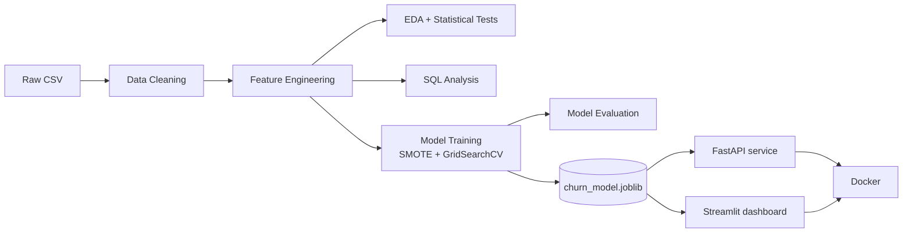

# Customer Churn Prediction

[](.github/workflows/ci.yml)
[](https://www.python.org/)
[](LICENSE)

A machine learning pipeline that predicts which telecom customers are likely to cancel their
service, built end to end: data cleaning, exploratory analysis, feature engineering, model
selection, and deployment behind a REST API and a dashboard.

Telecom churn is a classic retention problem — losing a customer costs a lot more than keeping
one, so the goal here is to rank customers by churn risk before they leave, and to back that up
with an explanation of *why* (which segments are at risk, and how much revenue that represents).

## Results

Held-out test set:

| Metric | Score |
|---|---|
| ROC-AUC | 0.841 |
| Accuracy | 79.2% |
| Precision (churn) | 59.7% |
| Recall (churn) | 66.4% |
| F1 (churn) | 0.629 |

XGBoost was the best of three models compared (Logistic Regression, Random Forest, XGBoost),
each tuned with 5-fold cross-validated GridSearchCV. Full comparison in
[reports/model_comparison.csv](reports/model_comparison.csv).

One of the clearer findings: month-to-month customers on fiber internet who pay by electronic
check churn at about 54%, versus single digits for two-year contract customers on automatic
payment. Confirmed with chi-square testing (p < 0.001), not just eyeballing a chart — see
[reports/sql_insights.md](reports/sql_insights.md) and
[reports/statistical_tests.json](reports/statistical_tests.json).

<p align="center">
  
  
  
</p>

## Architecture



## Stack

Python, Pandas, NumPy, SciPy, SQL (SQLite)
scikit-learn, XGBoost, imbalanced-learn
Matplotlib, Seaborn, Plotly
FastAPI, Pydantic, Streamlit
Docker, GitHub Actions, pytest

## Project structure

```
customer-churn-prediction/
├── api/                  FastAPI service (predict, predict/batch, health, metadata)
├── dashboard/             Streamlit app (overview, live predict, model performance)
├── src/
│   ├── data/               cleaning + SQL analysis
│   ├── features/            feature engineering + preprocessing pipeline
│   ├── models/              training (GridSearchCV) + evaluation
│   └── visualization/       EDA + statistical tests
├── notebooks/             EDA / feature engineering / modeling, executed with outputs
├── tests/                 pytest suite (26 tests)
├── reports/                generated metrics, figures, SQL insights
├── models/                 saved model + preprocessing pipeline
├── data/                   raw + processed data, SQLite db
├── Dockerfile, docker-compose.yml
└── .github/workflows/ci.yml
```

## Quickstart

```bash
git clone https://github.com/NihalKhatwani/customer-churn-prediction.git && cd customer-churn-prediction
python3 -m venv .venv && source .venv/bin/activate
pip install -r requirements.txt
```

Run the pipeline (reproduces everything in `reports/` and `models/`):

```bash
python -m src.data.make_dataset
python -m src.features.build_features
python -m src.visualization.visualize
python -m src.data.sql_analysis
python -m src.models.train_model
python -m src.models.evaluate_model
```

Run the tests:

```bash
pytest
```

Serve the model:

```bash
uvicorn api.main:app --reload --port 8000
# docs at http://localhost:8000/docs
```

```bash
curl -X POST http://localhost:8000/predict \
  -H "Content-Type: application/json" \
  -d '{
    "gender": "Female", "SeniorCitizen": "No", "Partner": "Yes", "Dependents": "No",
    "tenure": 5, "PhoneService": "Yes", "MultipleLines": "No", "InternetService": "Fiber optic",
    "OnlineSecurity": "No", "OnlineBackup": "No", "DeviceProtection": "No", "TechSupport": "No",
    "StreamingTV": "Yes", "StreamingMovies": "No", "Contract": "Month-to-month",
    "PaperlessBilling": "Yes", "PaymentMethod": "Electronic check",
    "MonthlyCharges": 85.4, "TotalCharges": 427.0
  }'
# -> {"churn_probability":0.8276,"churn_prediction":"Yes","risk_tier":"High", ...}
```

Launch the dashboard:

```bash
streamlit run dashboard/app.py
```

Or run both with Docker Compose (API on 8000, dashboard on 8501):

```bash
docker compose up --build
```

## How it works

1. **Cleaning** — coerce `TotalCharges` to numeric (11 blank values from zero-tenure customers),
   normalize categorical encodings, drop 22 duplicate rows.
   [src/data/make_dataset.py](src/data/make_dataset.py)
2. **EDA + hypothesis testing** — class balance, distributions, and chi-square/Welch's t-tests
   against the churn target. 14 of 16 categorical features and all 3 numeric features come out
   significant at p < 0.05. [src/visualization/visualize.py](src/visualization/visualize.py),
   [notebooks/01_eda.ipynb](notebooks/01_eda.ipynb)
3. **SQL analysis** — the cleaned data loaded into SQLite, business questions answered in plain
   SQL (window functions, CTEs, aggregations).
   [src/data/sql_analysis.py](src/data/sql_analysis.py)
4. **Feature engineering** — seven derived features (tenure buckets, active-service count,
   contract risk score, etc.) plus a `ColumnTransformer` shared identically across training,
   the API, and the dashboard so there's no train/serve mismatch.
   [src/features/build_features.py](src/features/build_features.py)
5. **Modeling** — Logistic Regression, Random Forest, and XGBoost tuned with GridSearchCV
   (5-fold, ROC-AUC), with SMOTE applied inside each CV fold to avoid leaking oversampled data
   into the validation split. [src/models/train_model.py](src/models/train_model.py)
6. **Evaluation** — confusion matrix, ROC/PR curves, classification report, feature importance.
   [src/models/evaluate_model.py](src/models/evaluate_model.py)
7. **Deployment** — the fitted pipeline served through FastAPI (single + batch prediction,
   health/metadata endpoints) and a Streamlit dashboard, both containerized and tested in CI on
   every push.

## Dataset

[IBM Telco Customer Churn](https://github.com/IBM/telco-customer-churn-on-icp4d) — 7,043
customers, 21 attributes. A standard public benchmark for churn modeling.

## Testing

26 tests covering data cleaning, feature engineering, model quality (regression guard on
ROC-AUC), and the API's contract and behavior.

```bash
pytest -v
```

## License

MIT — see [LICENSE](LICENSE).
