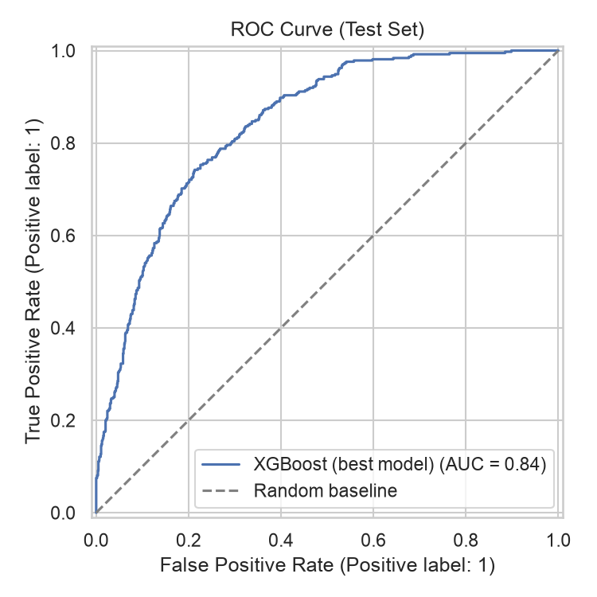
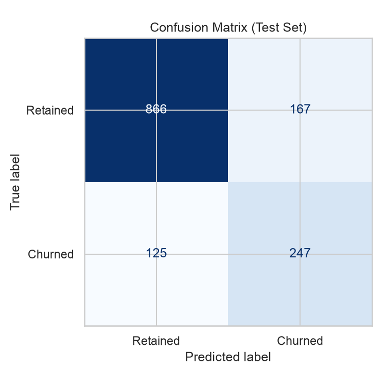
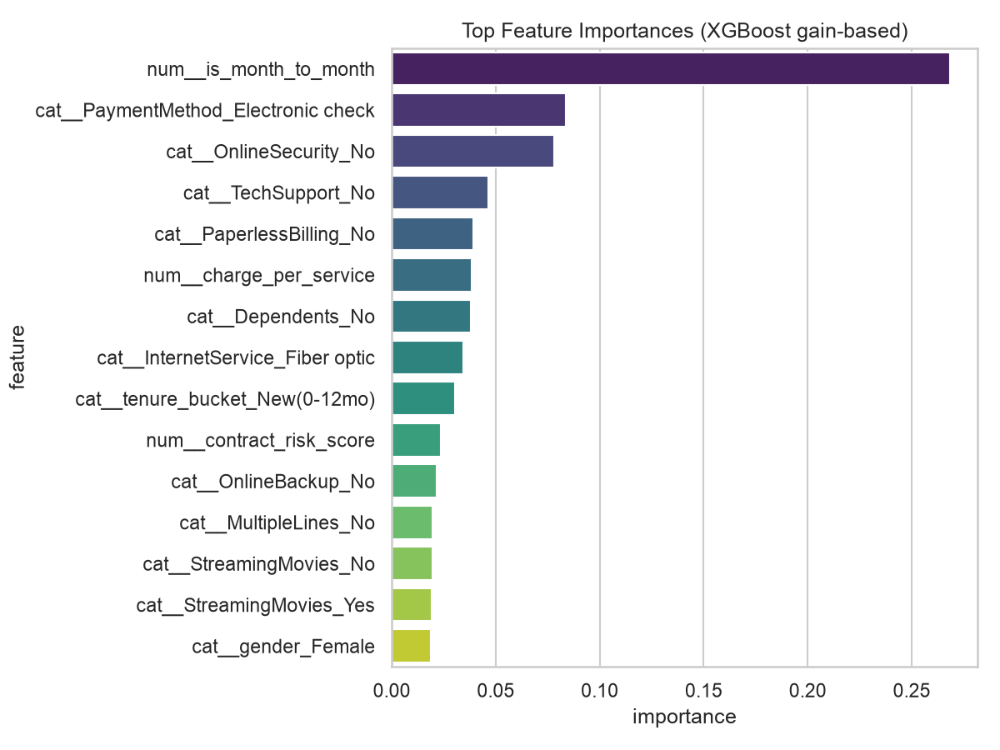
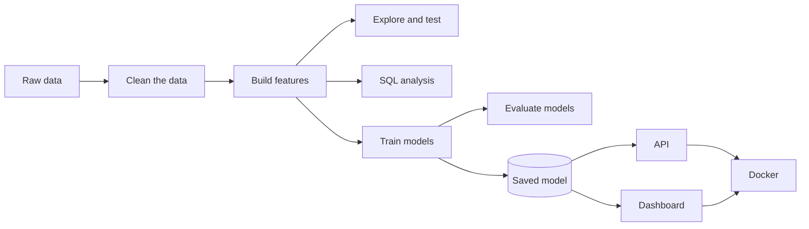

# Customer Churn Prediction

[](.github/workflows/ci.yml)
[](https://www.python.org/)
[](LICENSE)

This project predicts which telecom customers are likely to cancel their service (churn).
It uses real customer data to train a machine learning model, then makes that model available
through a web API and a simple dashboard.

The idea: it costs a company much more to win a new customer than to keep an existing one. If you
can flag risky customers early, a retention team can reach out before they leave.

## What the model does

Using a real dataset of 7,000+ telecom customers, the model looks at things like contract type,
monthly bill, and which services a customer has, and predicts how likely they are to leave.

Test results:

| Metric | Score |
|---|---|
| ROC-AUC | 0.841 |
| Accuracy | 79.2% |
| Precision (churn) | 59.7% |
| Recall (churn) | 66.4% |
| F1 (churn) | 0.629 |

Three models were compared (Logistic Regression, Random Forest, and XGBoost), each tuned to find
its best settings. XGBoost performed best. Full comparison is in
[reports/model_comparison.csv](reports/model_comparison.csv).

One clear pattern in the data: customers on month to month contracts, with fiber internet, who
pay by electronic check, cancel about 54% of the time. Customers on two year contracts with
automatic payment cancel far less often. This was checked with a statistical significance test,
not just a chart. See [reports/sql_insights.md](reports/sql_insights.md) for the full breakdown.

<p align="center">
  
  
  
</p>

## How the pieces fit together



## Tools used

- Python, Pandas, NumPy, SciPy
- SQL (SQLite)
- scikit-learn, XGBoost, imbalanced-learn
- Matplotlib, Seaborn, Plotly
- FastAPI, Pydantic, Streamlit
- Docker, GitHub Actions, pytest

## Project layout

```
customer-churn-prediction/
├── api/                  the web API (predict, health check, etc.)
├── dashboard/             the Streamlit dashboard
├── src/
│   ├── data/               cleans data, runs SQL analysis
│   ├── features/            builds features for the model
│   ├── models/              trains and evaluates models
│   └── visualization/       charts and statistical tests
├── notebooks/             notebooks showing the analysis step by step
├── tests/                 automated tests (26 total)
├── reports/                generated charts, metrics, and summaries
├── models/                 the saved, trained model
├── data/                   raw and cleaned data
├── Dockerfile, docker-compose.yml
└── .github/workflows/ci.yml
```

## Getting started

```bash
git clone https://github.com/NihalKhatwani/customer-churn-prediction.git && cd customer-churn-prediction
python3 -m venv .venv && source .venv/bin/activate
pip install -r requirements.txt
```

Run the full pipeline. This rebuilds everything in `reports/` and `models/`:

```bash
python -m src.data.make_dataset
python -m src.features.build_features
python -m src.visualization.visualize
python -m src.data.sql_analysis
python -m src.models.train_model
python -m src.models.evaluate_model
```

Run the tests:

```bash
pytest
```

Start the API:

```bash
uvicorn api.main:app --reload --port 8000
# docs at http://localhost:8000/docs
```

Try a prediction:

```bash
curl -X POST http://localhost:8000/predict \
  -H "Content-Type: application/json" \
  -d '{
    "gender": "Female", "SeniorCitizen": "No", "Partner": "Yes", "Dependents": "No",
    "tenure": 5, "PhoneService": "Yes", "MultipleLines": "No", "InternetService": "Fiber optic",
    "OnlineSecurity": "No", "OnlineBackup": "No", "DeviceProtection": "No", "TechSupport": "No",
    "StreamingTV": "Yes", "StreamingMovies": "No", "Contract": "Month-to-month",
    "PaperlessBilling": "Yes", "PaymentMethod": "Electronic check",
    "MonthlyCharges": 85.4, "TotalCharges": 427.0
  }'
# returns something like: {"churn_probability":0.8276,"churn_prediction":"Yes","risk_tier":"High"}
```

Start the dashboard:

```bash
streamlit run dashboard/app.py
```

Or run both the API and dashboard together with Docker:

```bash
docker compose up --build
```

## The steps, in order

1. **Clean the data.** Fix missing values, standardize labels, remove duplicates.
   [src/data/make_dataset.py](src/data/make_dataset.py)
2. **Explore the data and test it statistically.** Look at churn rates by group, then confirm
   which patterns are actually significant and not just noise.
   [src/visualization/visualize.py](src/visualization/visualize.py),
   [notebooks/01_eda.ipynb](notebooks/01_eda.ipynb)
3. **Analyze with SQL.** Load the data into a small database and answer business questions
   using SQL queries. [src/data/sql_analysis.py](src/data/sql_analysis.py)
4. **Build features.** Create new, more useful columns from the raw data (like a tenure group or
   a count of active services) and prepare everything for the model.
   [src/features/build_features.py](src/features/build_features.py)
5. **Train models.** Compare three different model types and tune each one to find its best
   settings, using cross validation so results aren't just luck.
   [src/models/train_model.py](src/models/train_model.py)
6. **Evaluate the model.** Check accuracy, precision, recall, and which features matter most.
   [src/models/evaluate_model.py](src/models/evaluate_model.py)
7. **Deploy it.** Serve the model through a web API and a dashboard, both packaged with Docker
   and tested automatically whenever code changes.

## About the data

The data comes from [IBM's Telco Customer Churn dataset](https://github.com/IBM/telco-customer-churn-on-icp4d),
a public dataset with 7,043 customers and 21 attributes. It's a well known dataset commonly used
to practice and demonstrate churn prediction.

## Testing

There are 26 automated tests covering data cleaning, feature building, model quality, and the
API's behavior.

```bash
pytest -v
```

## License

MIT. See [LICENSE](LICENSE).
