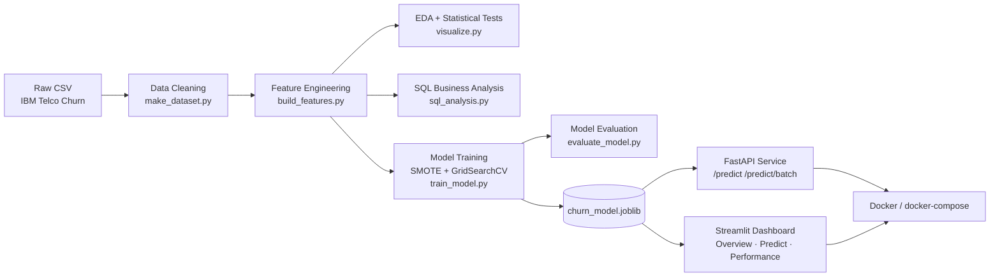

# 📉 Customer Churn Prediction — End-to-End Machine Learning System

[](.github/workflows/ci.yml)
[](https://www.python.org/)
[](https://scikit-learn.org/)
[](https://xgboost.readthedocs.io/)
[](https://fastapi.tiangolo.com/)
[](https://streamlit.io/)
[](Dockerfile)
[](LICENSE)

A production-style **machine learning system** that predicts telecom customer churn, quantifies
revenue at risk, and ships the model as a live REST API and an interactive analytics dashboard.
Built to demonstrate the full **data science lifecycle**: exploratory data analysis, statistical
hypothesis testing, feature engineering, SQL-based business analysis, model selection with
cross-validated hyperparameter tuning, class-imbalance handling, model evaluation/interpretability,
and MLOps-style deployment (REST API, Docker, CI/CD).

> **Business problem:** Telecom companies lose ~15-25% of customers annually. Acquiring a new
> customer costs 5-25x more than retaining one. This project builds a model that flags at-risk
> customers *before* they churn so a retention team can intervene, and quantifies exactly how
> much monthly recurring revenue is at stake per customer segment.

---

## 🏆 Results at a glance

| Metric (held-out test set) | Score |
|---|---|
| **ROC-AUC** | **0.841** |
| Accuracy | 79.2% |
| Precision (churn class) | 59.7% |
| Recall (churn class) | 66.4% |
| F1-score (churn class) | 0.629 |
| Cross-validated ROC-AUC (5-fold) | 0.847 |

**Best model:** XGBoost (tuned via `GridSearchCV`, beating Logistic Regression and Random Forest
on cross-validated ROC-AUC — see [`reports/model_comparison.csv`](reports/model_comparison.csv)).

**Key business insight (validated with SQL + chi-square testing, p < 0.001):** month-to-month
contract customers on fiber-optic internet paying by electronic check churn at **~54%** — nearly
20x the rate of two-year-contract customers on automatic payment. See
[`reports/sql_insights.md`](reports/sql_insights.md) and
[`reports/statistical_tests.json`](reports/statistical_tests.json) for the full analysis.

<p align="center">
  
  
  
</p>

---

## 🧱 Architecture



---

## 🛠️ Tech stack & keywords

**Languages & core libraries:** Python, SQL, Pandas, NumPy, SciPy
**Machine learning:** scikit-learn, XGBoost, imbalanced-learn (SMOTE), GridSearchCV, cross-validation,
hyperparameter tuning, feature engineering, feature importance, model interpretability
**Statistics:** hypothesis testing, chi-square test of independence, Welch's t-test, p-values,
correlation analysis, class imbalance handling
**Data visualization:** Matplotlib, Seaborn, Plotly
**MLOps / deployment:** FastAPI, Pydantic, REST API, Docker, Docker Compose, CI/CD (GitHub Actions),
Streamlit, model versioning, pytest, unit testing, integration testing
**Data engineering:** SQLite, ETL pipeline, data cleaning, data validation, Jupyter Notebook

---

## 📂 Project structure

```
customer-churn-prediction/
├── api/                       # FastAPI inference service
│   ├── main.py                 #   /predict, /predict/batch, /health, /model/metadata
│   └── schemas.py               #   Pydantic request/response contracts
├── dashboard/
│   └── app.py                  # Streamlit app: Overview / Predict / Model Performance tabs
├── src/
│   ├── data/
│   │   ├── make_dataset.py      # cleaning, type coercion, target encoding
│   │   └── sql_analysis.py      # SQLite + business SQL (window functions, CTEs)
│   ├── features/
│   │   └── build_features.py    # engineered features + ColumnTransformer pipeline
│   ├── models/
│   │   ├── train_model.py       # SMOTE + GridSearchCV over 3 classifiers
│   │   └── evaluate_model.py    # confusion matrix, ROC/PR curves, feature importance
│   └── visualization/
│       └── visualize.py         # EDA plots + chi-square / t-test significance testing
├── notebooks/                  # 01_eda, 02_feature_engineering, 03_modeling (executed, with outputs)
├── tests/                      # pytest: data, features, model, API (26 tests)
├── reports/                    # generated metrics, figures, SQL insights, stat-test results
├── models/                     # persisted model + preprocessing pipeline artifacts
├── data/                       # raw + processed data, SQLite db
├── Dockerfile · docker-compose.yml
├── .github/workflows/ci.yml    # lint → pipeline → train → test → docker build
└── RESUME_BULLETS.md            # ready-to-use resume bullet points for this project
```

---

## 🚀 Quickstart

```bash
git clone <your-repo-url> && cd customer-churn-prediction
python3 -m venv .venv && source .venv/bin/activate
pip install -r requirements.txt
```

**Run the full pipeline** (reproduces every artifact in `reports/` and `models/`):

```bash
python -m src.data.make_dataset
python -m src.features.build_features
python -m src.visualization.visualize
python -m src.data.sql_analysis
python -m src.models.train_model
python -m src.models.evaluate_model
```

**Run the tests:**

```bash
pytest
```

**Serve the model via REST API:**

```bash
uvicorn api.main:app --reload --port 8000
# Interactive Swagger docs: http://localhost:8000/docs
```

```bash
curl -X POST http://localhost:8000/predict \
  -H "Content-Type: application/json" \
  -d '{
    "gender": "Female", "SeniorCitizen": "No", "Partner": "Yes", "Dependents": "No",
    "tenure": 5, "PhoneService": "Yes", "MultipleLines": "No", "InternetService": "Fiber optic",
    "OnlineSecurity": "No", "OnlineBackup": "No", "DeviceProtection": "No", "TechSupport": "No",
    "StreamingTV": "Yes", "StreamingMovies": "No", "Contract": "Month-to-month",
    "PaperlessBilling": "Yes", "PaymentMethod": "Electronic check",
    "MonthlyCharges": 85.4, "TotalCharges": 427.0
  }'
# -> {"churn_probability":0.8276,"churn_prediction":"Yes","risk_tier":"High", ...}
```

**Launch the dashboard:**

```bash
streamlit run dashboard/app.py
```

**Run with Docker Compose** (API on `:8000`, dashboard on `:8501`):

```bash
docker compose up --build
```
> Note: the Docker build was authored to a standard, widely-used pattern (slim Python base +
> `libgomp1` for XGBoost) but could not be live-tested in this sandbox (no Docker daemon
> available here) — verify with `docker compose up --build` in your own environment before
> relying on it for a demo.

---

## 🔬 Methodology

1. **Data cleaning** — coerced `TotalCharges` to numeric (11 blank values from zero-tenure
   customers), standardized categorical encodings, dropped 22 duplicate rows. See
   [`src/data/make_dataset.py`](src/data/make_dataset.py).
2. **Exploratory data analysis + hypothesis testing** — profiled class balance (26.4% churn),
   numeric/categorical distributions, and ran chi-square tests of independence (categorical) and
   Welch's t-tests (numeric) against the churn target. **14/16 categorical and 3/3 numeric
   features were statistically significant at p < 0.05.** See
   [`src/visualization/visualize.py`](src/visualization/visualize.py) and
   [`notebooks/01_eda.ipynb`](notebooks/01_eda.ipynb).
3. **SQL business analysis** — loaded the cleaned data into SQLite and answered stakeholder
   questions with pure SQL (aggregations, `CASE` binning, `RANK() OVER` window functions, CTEs) —
   see [`src/data/sql_analysis.py`](src/data/sql_analysis.py) and
   [`reports/sql_insights.md`](reports/sql_insights.md).
4. **Feature engineering** — 7 domain-driven features (`tenure_bucket`, `num_active_services`,
   `avg_monthly_spend`, `charge_per_service`, `is_month_to_month`, `contract_risk_score`,
   `has_internet`) plus a `ColumnTransformer` (median-safe scaling + one-hot encoding with
   `handle_unknown='ignore'`) shared identically across training, testing, the API, and the
   dashboard to eliminate train/serve skew. See
   [`src/features/build_features.py`](src/features/build_features.py).
5. **Modeling** — Logistic Regression, Random Forest, and XGBoost, each tuned with
   `GridSearchCV` (5-fold stratified CV, ROC-AUC scoring) inside an `imbalanced-learn` pipeline
   that applies **SMOTE oversampling** *after* preprocessing and *inside* each CV fold (no data
   leakage). See [`src/models/train_model.py`](src/models/train_model.py) and
   [`notebooks/03_modeling.ipynb`](notebooks/03_modeling.ipynb).
6. **Evaluation & interpretability** — confusion matrix, ROC curve, precision-recall curve,
   classification report, and gain-based feature importance for the winning model. See
   [`src/models/evaluate_model.py`](src/models/evaluate_model.py).
7. **Deployment** — the fitted pipeline is served through a versioned **FastAPI** REST contract
   (Pydantic-validated request/response schemas, single + batch scoring, health/metadata
   endpoints) and visualized in a 3-tab **Streamlit** dashboard, both containerized with **Docker**
   and wired into a **GitHub Actions CI** workflow that lints, reproduces the pipeline, retrains,
   tests, and builds the image on every push.

---

## 📊 Dataset

[IBM Telco Customer Churn](https://github.com/IBM/telco-customer-churn-on-icp4d) — 7,043
customers, 21 attributes (demographics, account info, subscribed services, billing), publicly
available and widely used as an industry-standard churn-modeling benchmark.

---

## 🧪 Testing

26 tests across data cleaning, feature engineering, model quality regression guards, and API
contract/behavior (including a semantic check that a high-risk customer profile scores higher
than a low-risk one):

```bash
pytest -v
```

---

## 📄 License

MIT — see [LICENSE](LICENSE).

---

## 📝 Resume bullet points

Ready-to-use, ATS-friendly bullet points for this project are in
[`RESUME_BULLETS.md`](RESUME_BULLETS.md).
